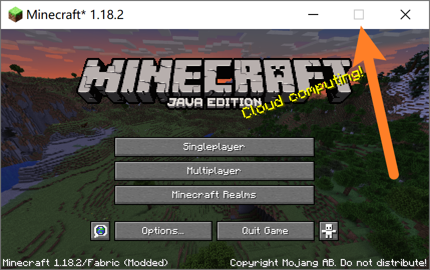

# Locked Window Size


[](http://www.gnu.org/licenses/lgpl-3.0.html)
[](https://github.com/Fallen-Breath/classic-minecraft-icon/actions/workflows/gradle.yml)
[](https://legacy.curseforge.com/minecraft/mc-mods/classic-minecraft-icon)
[](https://legacy.curseforge.com/minecraft/mc-mods/classic-minecraft-icon)
[](https://modrinth.com/mod/classic-minecraft-icon)

A simple Minecraft mod that make the game window un-resizeable

It's a fabric mod that works in all version and requires no extra dependency

How does it work? With this one-line magic code:

```java
GLFW.glfwWindowHint(GLFW.GLFW_RESIZABLE, GLFW.GLFW_FALSE);
```


